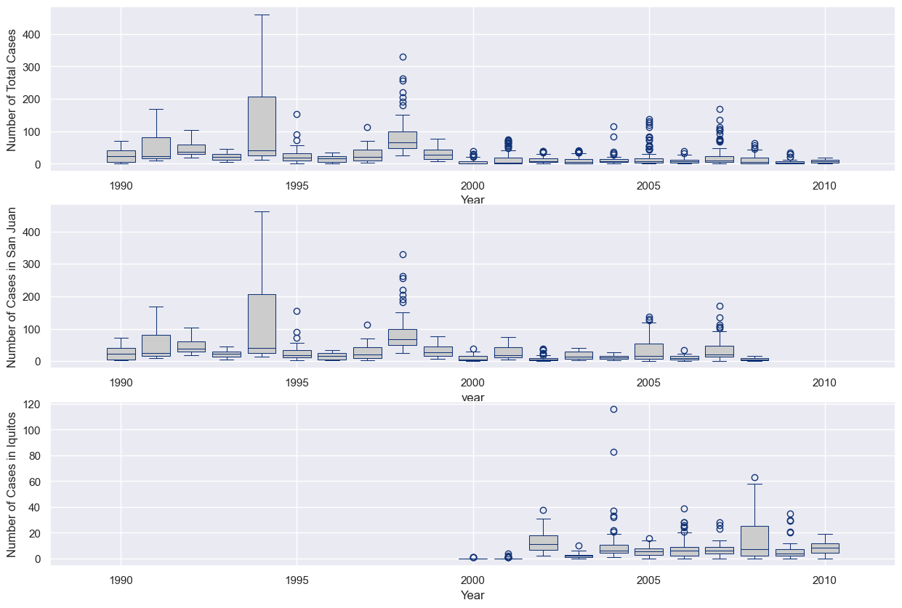

# Dengue Fever Prediction

This repository contains the code and models developed for the [Dengue Prediction competition](https://www.drivendata.org/competitions/44/dengai-predicting-disease-spread/page/80/) hosted on [drivendata.org](https://www.drivendata.org). The goal of this competition is to **predict the number of dengue fever cases** each week in two cities: San Juan, Puerto Rico, and Iquitos, Peru.

We used the Kedro framework for project structure and end-to-end implementation.

## Outcomes

Final submission score: ``24.57``

## Try it out
You can run this repository locally to test it out:
1. Clone this repository into a local project folder: 
    - ``git clone git@github.com:Lucamiras/DengAI.git``
2. Create a new conda environment:
    - ``conda create [YOUR ENVIRONMENT NAME] python=3.12``
3. Activate your new environment:
    - ``conda activate [YOUR ENVIRONMENT NAME]``
4. Install dependencies:
    - ``pip install -r requirements.txt``
5. To run the full pipeline:
    - ``kedro run --pipeline __default__``
6. Once the pipeline has run, you can find the new predictions ``.csv`` in ``data/07_model_output``

## Data exploration
We plotted the development of total cases to get an intuition for features that impact number of cases:

Looking at the distribution over time by city, we see spikes of outbreaks around the years '91, '94, '98, '05 and '08.

Looking at the most correlated feature, ``min_air_temperature_k`` readings seem to align with spikes in ``total_cases``.

## Feature engineering
These choices led to the biggest improvement in score:
- Forward-filled missing values. Forward-fill seemed the best choice for time-series problems.
- Implemented rolling averages of 2, 4 and 6 weeks respectively for 7 most correlated features, which allows the model to understand how time lag impacts case numbers.
- Implemented cyclical encoding for ``weekofyear``.

## Repository Structure
- **conf**: Contains Kedro config files.
- **data**: Contains the raw datasets used in the project.
- **images**: Images used in this notebooks, mainly data visualizations.
- **src**: Python files for two Kedro pipelines:
    - Data Processing: Handle null values, create rolling averages, encodings, dropping unused columns
    - Data Science: Split data into X and y, train model, create submissions

- **README.md**: Overview of the project, outcomes, and implementation notes (you're here!).

## Noteworthy
- In this project, we are training the model on the entire dataset. In a previous version we used train and validation sets, but found that our validation score was almost never reflecting a real submission score increase. Due to this and the time series nature of the problem, we chose to train the model on the whole dataset. Others may disagree with this and return to 